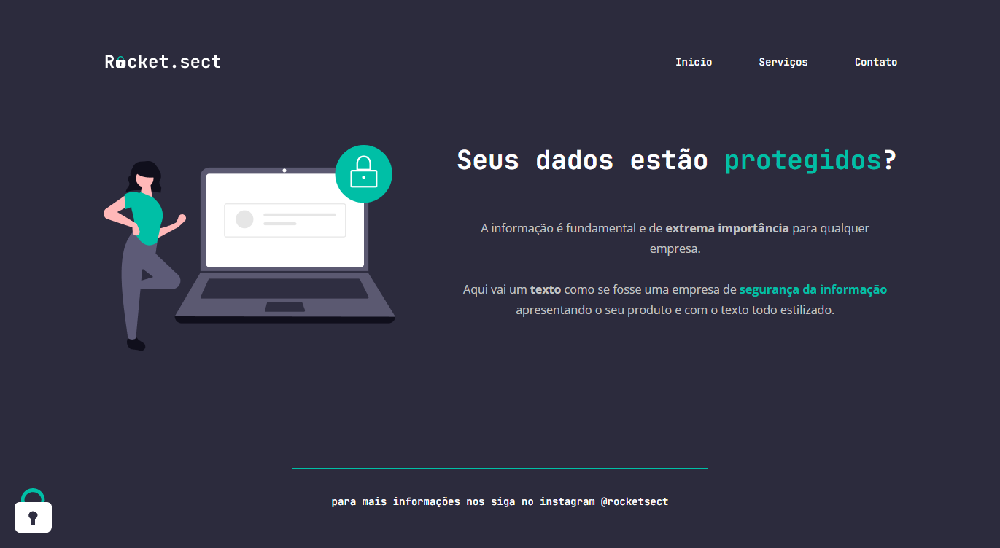

# Desafio - Recriando Layout

> Explorer Stage 02 da Rocketseat

## 📝 Descrição
Projeto desenvolvido no curso Explorer da Rocketseat. 

A proposta era recriar o layout disponibilizado para treinar os conhecimentos adquiridos.

[Design no figma](https://www.figma.com/file/EdKjPWjC8ZlbnH4XzTObv2/Explorer/duplicate)

## 💻 Tecnologias 
- HTML
- CSS
